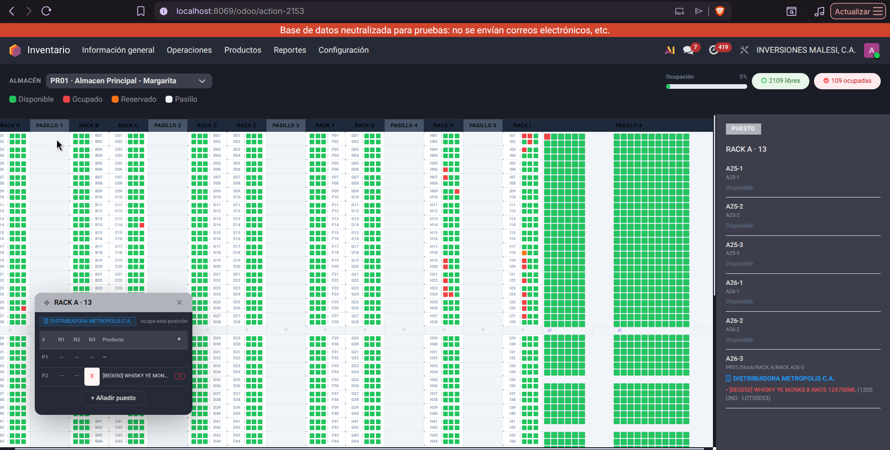

# Mapa Virtual del Almacén

Módulo de Odoo 19 que añade un **mapa interactivo 2D del almacén** con racks,
pasillos, ocupación en tiempo real, tooltips, edición manual, importación y
exportación a Excel.

> Desarrollado para **BrandIA / Grupo Leiros**. Está pensado para el almacén
> principal *"Almacen Principal - Margarita" (PR01)* pero funciona con
> cualquier almacén físico configurado.

---

## Video explicativo

Mira este video para ver el módulo en funcionamiento:

📺 [Ver video explicativo](https://drive.google.com/file/d/14_UGwl7OUlyPLBermr9UicOOA_EXInxi/view?usp=sharing)

## Imagen de referencia



---

## Tabla de contenidos

- [Requisitos](#requisitos)
- [Instalación](#instalación)
  - [1. Copiar el módulo](#1-copiar-el-módulo)
  - [2. Añadir la carpeta al addons_path](#2-añadir-la-carpeta-al-addons_path)
  - [3. Instalar el módulo](#3-instalar-el-módulo)
  - [4. Verificar](#4-verificar)
- [Actualización del módulo](#actualización-del-módulo)
- [Configuración inicial](#configuración-inicial)
- [Solución de problemas](#solución-de-problemas)
- [Documentación técnica](#documentación-técnica)

---

## Requisitos

| Requisito   | Valor                              |
| ----------- | ---------------------------------- |
| Odoo        | 19.0 (Community o Enterprise)      |
| Python      | 3.10+                              |
| Dependencias Python | `xlsxwriter` (exportación) y `openpyxl` (importación) |
| Dependencias Odoo  | `stock`, `web`                     |

Instala las dependencias Python del sistema:

```bash
pip install xlsxwriter openpyxl
```

> **Nota Enterprise**: este módulo es independiente de `mrp`, `account` u otros
> módulos Enterprise; funciona igual en Community siempre que exista `stock`.

---

## Instalación

### 1. Copiar el módulo

Copia la carpeta completa del módulo a tu carpeta de addons personalizados:

```bash
# Ejemplo: en una instalación con carpeta custom_addons
cp -r stock_warehouse_map /opt/odoo/custom_addons/
```

La estructura mínima que debe llegar al servidor:

```
stock_warehouse_map/
├── __manifest__.py
├── __init__.py
├── controllers/        # Rutas HTTP/JSON-RPC
├── data/               # Configuración inicial de racks y pasillos
├── models/             # Modelos warehouse.map, warehouse.map.rack
├── security/           # Permisos de acceso (CSV)
├── static/             # Assets web (JS/OWL, CSS, icono)
├── views/              # Menús y vistas de configuración
└── wizards/            # Asistente de importación desde Excel
```

### 2. Añadir la carpeta al addons_path

Asegúrate de que la carpeta que contiene a `stock_warehouse_map` esté en la
variable `addons_path` de tu `odoo.conf`:

```ini
[options]
addons_path = /opt/odoo/odoo-19.0/addons,/opt/odoo/custom_addons
```

### 3. Instalar el módulo

1. Reinicia Odoo (para que descubra el nuevo módulo).
2. Entra en *Aplicaciones → Actualizar Lista de Aplicaciones* (o activa el
   modo de desarrollador y usa *Actualizar aplicaciones*).
3. Busca **Mapa Virtual del Almacén**.
4. Pulsa **Instalar**.

### 4. Verificar

1. Ve al módulo **Inventario**.
2. En el menú superior, abre **Configuración → Mapa Virtual → Ver Mapa Virtual**.
3. Deberías ver la grilla con los racks **RACK A–I**, los pasillos
   **PASILLO 1–5** y el **PASILLO 6**.

> Si el mapa muestra *"El mapa 2D solo está disponible para el almacén
> 'Almacen Principal - Margarita' (PR01)"*, selecciona ese almacén en el
> desplegable superior del mapa.

---

## Actualización del módulo

Tras modificar vistas, datos o código, actualiza el módulo para que Odoo
regenere los assets y reaplique los cambios:

```bash
# Con el servidor corriendo
./odoo-bin -u stock_warehouse_map -d NOMBRE_BD --stop-after-init
```

> En Odoo 19, tras editar código **JS/CSS** normalmente basta con **Actualizar
> la aplicación** desde la vista de la app (menú ⟳ / "Actualizar") y recargar
> la página del navegador con Ctrl+Shift+R (evita caché de assets).

---

## Configuración inicial

La configuración por defecto se instala con el módulo (`data/warehouse_map_data.xml`):

| Rack       | Tipo      | Posiciones | Niveles | Pasillos |
| ---------- | --------- | ---------- | ------- | -------- |
| RACK A     | rack      | 43         | 3       | 15, 37   |
| PASILLO 1  | aisle     | 43         | –       | –        |
| RACK B     | rack      | 43         | 3       | 15, 37   |
| RACK C     | rack      | 43         | 3       | 15, 37   |
| PASILLO 2  | aisle     | 43         | –       | –        |
| RACK D     | rack      | 43         | 3       | 15, 37   |
| RACK E     | rack      | 43         | 3       | 15, 37   |
| PASILLO 3  | aisle     | 43         | –       | –        |
| RACK F     | rack      | 43         | 3       | 15, 37   |
| RACK G     | rack      | 41         | 3       | 15, 37   |
| PASILLO 4  | aisle     | 43         | –       | –        |
| RACK H     | rack      | 41         | 3       | 15, 37   |
| PASILLO 5  | aisle     | 43         | –       | –        |
| RACK I     | rack      | 41         | 3       | 15, 37   |
| PASILLO 6  | special   | 90         | 1       | –        |

Esta configuración se puede editar en **Inventario → Configuración →
Configuración del Mapa** (modelo `warehouse.map`).

---

## Documentación técnica

Para conocer en detalle **cómo funciona el mapa, su lógica, los endpoints y
los condicionales**, consulta:

- [`docs/ARQUITECTURA.md`](docs/ARQUITECTURA.md) — arquitectura, flujo de
  datos, lógica del backend y del frontend.

